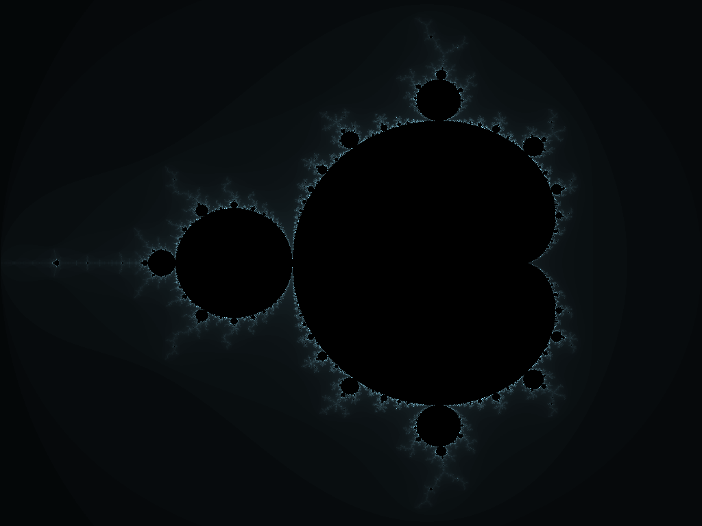
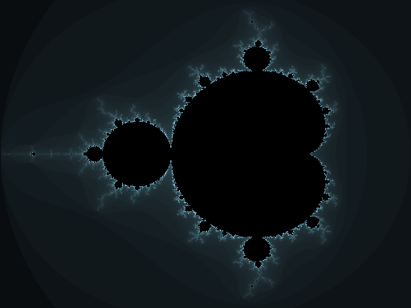

# CUDA: Conjunto de Mandelbrot

##  Visão Geral do Projeto

Este projeto implementa a renderização do **conjunto de Mandelbrot** em **CUDA** (GPU) e **Python** (CPU/NumPy).

### Objetivos Educacionais

1. **Computação Paralela em GPU**: Aprender conceitos de CUDA, kernels, threads, blocos e grids
2. **Otimização de Desempenho**: Comparar velocidade CPU (Python/NumPy) vs GPU (CUDA)
3. **Visualização Científica**: Gerar imagens de alta qualidade do fractal
4. **Acessibilidade**: Fornecer versões executáveis sem exigir hardware GPU

---

##  Conjunto de Mandelbrot

### O que é?

O **conjunto de Mandelbrot** é um fractal definido por uma iteração simples no plano complexo:

$z_{n+1} = z_n^2 + c$

Para cada pixel $(x, y)$ da imagem:
- $c = x + iy$ (número complexo correspondente à posição)
- $z_0 = 0$
- Itera até $|z_n| > 2$ (diverge) ou atinge número máximo de iterações
- A **cor** representa quantas iterações foram necessárias

### Exemplo Visual

*Imagem: Conjunto de Mandelbrot (1024768, 1000 iterações)  renderizado com CUDA/Python*

### Implementação

#### **mandelbrot.cu** (CUDA  GPU)
\\cuda
__global__ void mandelbrot_kernel(unsigned char *img, int w, int h, int maxIter,
                                  double xmin, double xmax, double ymin, double ymax)
\\`

- **Parallelismo**: Cada thread do GPU calcula um pixel independentemente
- **Grid Layout**: 1616 threads por bloco, múltiplos blocos cobrem toda a imagem
- **Saída**: Imagem PPM (P6 binary format) 24-bit RGB

#### **mandelbrot_python.py** (Python/NumPy  CPU)
- Loop Python simples com NumPy para operações vetorizadas
- Mais lento, mas portável (sem dependências de CUDA)

### Parâmetros

| Parâmetro | Padrão | Descrição |
|-----------|--------|-----------|
| width | 1024 | Resolução horizontal em pixels |
| height | 768 | Resolução vertical em pixels |
| maxIter | 1000 | Máximo de iterações (mais = mais detalhes) |
| output | mandelbrot.ppm | Arquivo de saída |

### Exemplo de Saída

Arquivo PPM (formato binário): P6 com header + dados RGB binários
- Visualizável com qualquer viewer de imagem (GIMP, Windows Photo Viewer, etc.)
- Convertível para PNG/JPEG com ferramentas externas

---

##  Como Usar

### Opção 1: Python (Recomendado para iniciar)

Não requer compilação. Rápido de testar.

#### Instalação

\\powershell
pip install numpy matplotlib
\\`

#### Executar Exemplos

\\powershell
cd c:\Users\gabii\GitHub\PParalela\trabalho3\cuda_examples

# Mandelbrot rápido (512384, 256 iterações)  ~1-2 segundos
python mandelbrot_python.py 512 384 256 mandelbrot_quick.ppm

# Mandelbrot detalhado (19201080, 1000 iterações)  ~30 segundos
python mandelbrot_python.py 1920 1080 1000 mandelbrot_hd.ppm

# Com parâmetros padrão (1024768, 1000 iterações)
python mandelbrot_python.py
\\`

#### Executar Demonstração

\\powershell
python demo.py
\\`

Gera: mandelbrot_demo.ppm (1024768)

#### Visualizar Resultados

\\powershell
# Abrir imagem PPM no visualizador padrão (Windows)
explorer mandelbrot_demo.ppm

# Converter PPM para PNG (mais compatível)
python convert_ppm.py mandelbrot_demo.ppm mandelbrot_demo.png
explorer mandelbrot_demo.png
\\`

---

### Opção 2: CUDA (GPU  Muito Mais Rápido)

Requer NVIDIA GPU + CUDA Toolkit.

#### Instalação do CUDA Toolkit

**No Windows nativo**:
1. Instalar [Visual Studio C++ Build Tools](https://visualstudio.microsoft.com/downloads/)
2. Instalar [CUDA Toolkit](https://developer.nvidia.com/cuda-downloads)
3. Adicionar ao PATH: C:\Program Files\NVIDIA GPU Computing Toolkit\CUDA\v13.x\bin

**Em WSL (Ubuntu)**:
\\ash
sudo apt-get update && sudo apt-get install nvidia-cuda-toolkit gcc g++ make
\\`

#### Compilar

**Windows**:
\\powershell
cd c:\Users\gabii\GitHub\PParalela\trabalho3\cuda_examples
nvcc -O3 mandelbrot.cu -o mandelbrot.exe
\\`

**WSL**:
\\ash
cd /mnt/c/Users/gabii/GitHub/PParalela/trabalho3/cuda_examples
nvcc -O3 mandelbrot.cu -o mandelbrot
\\`

#### Executar

\\ash
# Mandelbrot padrão (1024768, 1000 iterações)
./mandelbrot

# Mandelbrot customizado
./mandelbrot 1920 1080 1000 mandelbrot_gpu.ppm

echo "GPU:" && ./mandelbrot 1024 768 1000
echo "CPU:" && python3 mandelbrot_python.py 1024 768 1000
\\`

---

##  Estrutura de Arquivos

\\
trabalho3/cuda_examples/
 README.md                    # Este arquivo
 Makefile                     # Compilação CUDA
 mandelbrot.cu                # Kernel CUDA
 mandelbrot_python.py         # Implementação Python
 convert_ppm.py               # Conversor PPM  PNG
 demo.py                      # Script de demonstração
 mandelbrot_demo.ppm          # Exemplo (PPM)
 mandelbrot_demo.png          # Exemplo (PNG)
 mandelbrot_test.ppm          # Teste rápido (PPM)
 mandelbrot_test.png          # Teste rápido (PNG)
\\`

###  Galeria de Resultados

#### Mandelbrot (1024768, 1000 iterações)

#### Mandelbrot (512384, 256 iterações)

---

##  Análise de Desempenho

Comparação esperada com GTX 1660:

| Resolução | Iterações | Python (CPU) | CUDA (GPU) | Aceleração |
|-----------|-----------|--------------|-----------|-----------|
| 512384 | 256 | ~1-2s | ~5ms | **200-400** |
| 1024768 | 1000 | ~10s | ~20ms | **500** |
| 19201080 | 1000 | ~30-40s | ~50ms | **600-800** |

---

##  Detalhes Técnicos

### CUDA Concepts

- **Thread**: Unidade mínima de execução (1000s em paralelo)
- **Block**: Conjunto de threads com memória compartilhada (até 1024)
- **Grid**: Múltiplos blocos cobrindo toda a computação
- **Kernel**: Função executada no GPU

Exemplo de configuração:
\\cuda
dim3 block(16, 16);              // 256 threads por bloco
dim3 grid((w+15)/16, (h+15)/16); // Múltiplos blocos
mandelbrot_kernel<<<grid, block>>>(d_img, w, h, ...);
\\`

### Formato PPM (Netpbm)

- Simples, sem compressão, fácil de gerar
- Header: P6 + dimensões + max color value
- Dados: bytes RGB brutos
- Compatível com qualquer viewer de imagem

---

##  Referências

1. **Mandelbrot Set**
   - https://en.wikipedia.org/wiki/Mandelbrot_set
   - https://mathworld.wolfram.com/MandelbrotSet.html

2. **CUDA Programming**
   - https://docs.nvidia.com/cuda/
   - https://developer.nvidia.com/cuda-toolkit

3. **Python Libraries**
   - Matplotlib: https://matplotlib.org/
   - NumPy: https://numpy.org/

---

##  FAQ

**P: Posso rodar CUDA sem GPU NVIDIA?**
R: Não, precisa de hardware NVIDIA. Use Python como alternativa.

**P: Como comprimir arquivos PPM?**
R: Execute: python convert_ppm.py mandelbrot.ppm mandelbrot.png

**P: Como mudo a região renderizada?**
R: Modifique xmin, xmax, ymin, ymax no código (padrão: -2, 1, -1.2, 1.2).

**P: Qual resolução recomenda?**
R: 19201080 com 1000 iterações gera imagens detalhadas e bonitas.

---

##  Licença

Código educacional. Livre para usar, modificar e distribuir.
